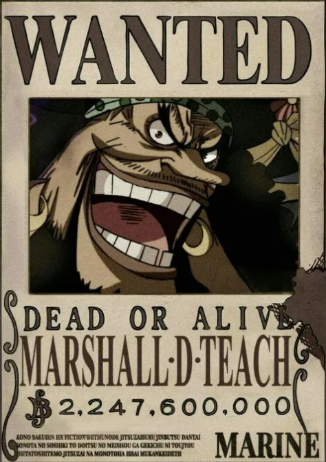
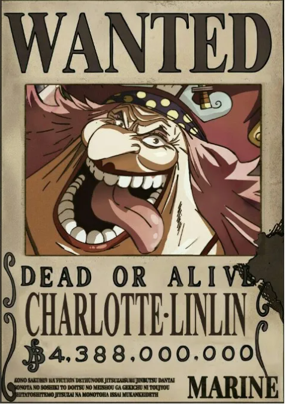
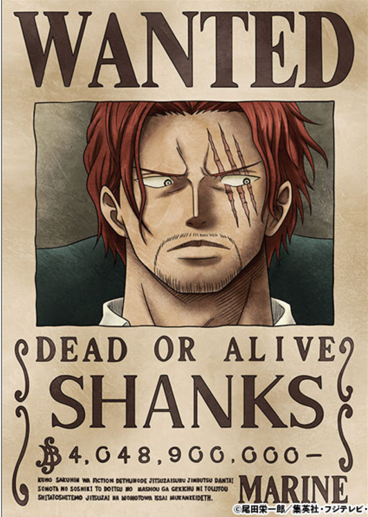
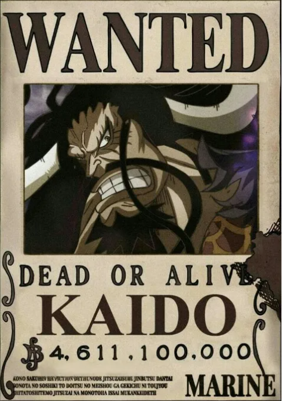
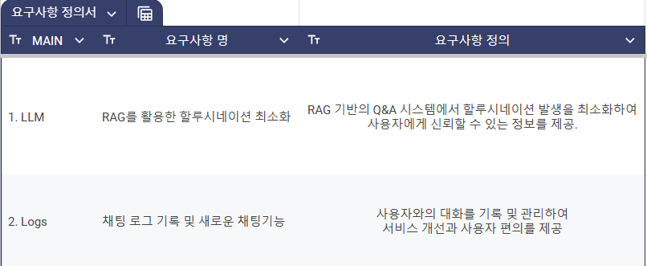
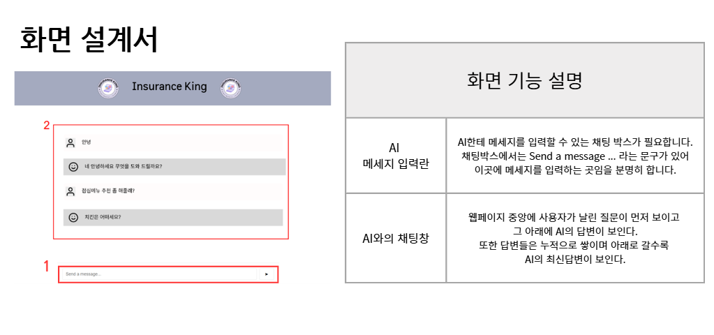
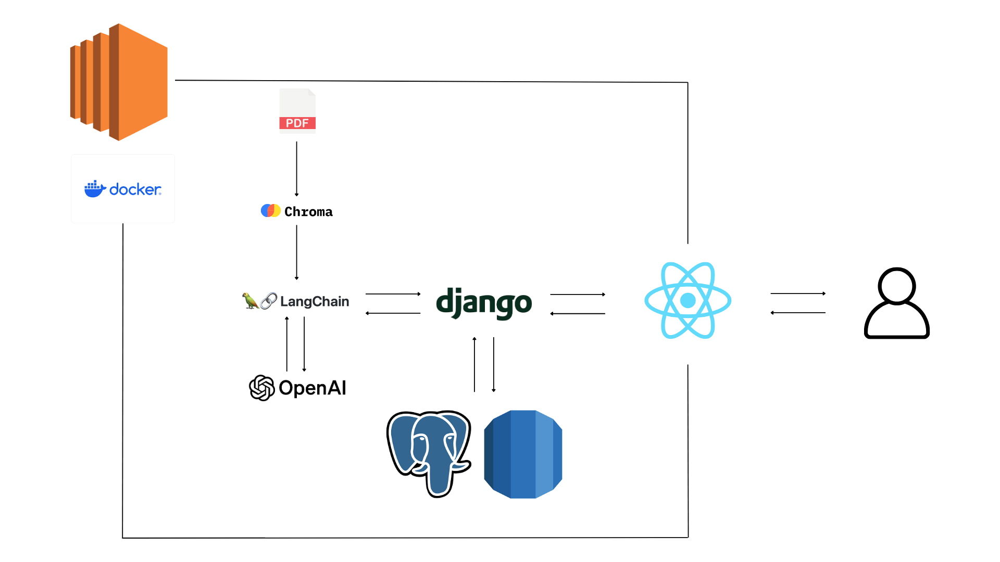

# 👑 보험왕이 될 거야 👑

	
	
	
	

|  &nbsp;&nbsp; &nbsp; &nbsp; &nbsp;  &nbsp;  &nbsp; 🐶 박화랑(팀장) &nbsp;&nbsp; &nbsp;&nbsp; &nbsp;  &nbsp;  &nbsp;    |      &nbsp;&nbsp; &nbsp;&nbsp; &nbsp;  &nbsp;  &nbsp; 🐙고유림  &nbsp;&nbsp; &nbsp;&nbsp; &nbsp;  &nbsp;  &nbsp;    |      &nbsp;&nbsp; &nbsp;&nbsp; &nbsp;  &nbsp;  &nbsp; 🐻김문수  &nbsp;&nbsp; &nbsp;&nbsp; &nbsp;  &nbsp;  &nbsp;    |     &nbsp;&nbsp; &nbsp;&nbsp; &nbsp;  &nbsp;  &nbsp; 😺신원영  &nbsp;&nbsp; &nbsp;&nbsp; &nbsp;  &nbsp;  &nbsp;   | |
|------------------------------------------|--------------------------------------|------------------------------------------|-----------------------------------|------------------------------------------|
| **요구사항 정의서, 화면설계서, README, CICD** | **Frontend (React)** | **Backend(Django)** | **Backend(Django), AWS** |

 
 

# 🤖 보험 약관 RAG Chatbot

## 📌 소개

GPT-4o-mini 기반 **보험 약관 RAG 챗봇**입니다. 보험사의 내부 가상 상담원이 특정 상품의 보험 약관을 쉽게 찾을 수 있도록 설계되었습니다. 복잡하고 일반적이지 않은 보험 약관의 내용을 벡터 DB 형태로 저장하여 LLM에서 효율적으로 검색할 수 있도록 하였습니다.

 
 

## 📌 동기

특정 보험 약관의 내용은 복잡하고 일반적인 정보가 아니기 때문에 기존 LLM에서 쉽게 찾아볼 수 없습니다. 이를 해결하기 위해 보험 약관을 벡터 DB로 저장하고, 내부 상담원이 쉽게 약관을 조회할 수 있는 시스템을 구축하였습니다.
궁금한 점은 바로 물어볼 수 있게 웹페이지로 구축하였습니다.

 
 

## 📌 요구사항 정의서

 

## 📌 화면 설계서

 
 

## ✏️ Model Architecture

## 🌲 폴더 트리

 
## 📌 기능

- **약관이 필요한 특정 상황에 대한 내용 설명 제공**

 
 

## 🛠️ 기술 스택

 

## 📌 구현 사항

### 1. PDF를 벡터 DB화하기

- **PyPDFLoader**를 통해 보험 약관 PDF 파일 파싱
- 문서를 일정한 청크로 분할
- **OpenAI의 text-embedding-3-small 모델**을 통해 임베딩
- **Chroma**를 통해 데이터 벡터화

 

### 2. RAG 시스템 구현

- **LangChain** 기반으로 벡터 DB를 가져와 RAG 시스템 구현
- 모델은 **OpenAI의 GPT-4o-mini** 사용
- **RunnableWithMessageHistory** 인스턴스를 사용해 대화 내용을 기억하도록 구현
- 문서 기반의 신뢰성 있는 답변을 제공하기 위해 **temperature**를 1보다 낮게 설정

### 3. Streamlit으로 만들었던 데모버전을 실제 웹페이지로 구현

- Javascript의 라이브러리인 **React**를 화면을 구현했습니다.
- 백엔드로는 파이썬 프레임워크인 **Django**를 사용했습니다.
- 배포를 위해서 **AWS EC2**와 **Docker**를 사용했습니다.
- CI/CD는 **AWS CODE DEPLOY**를 사용했습니다.

